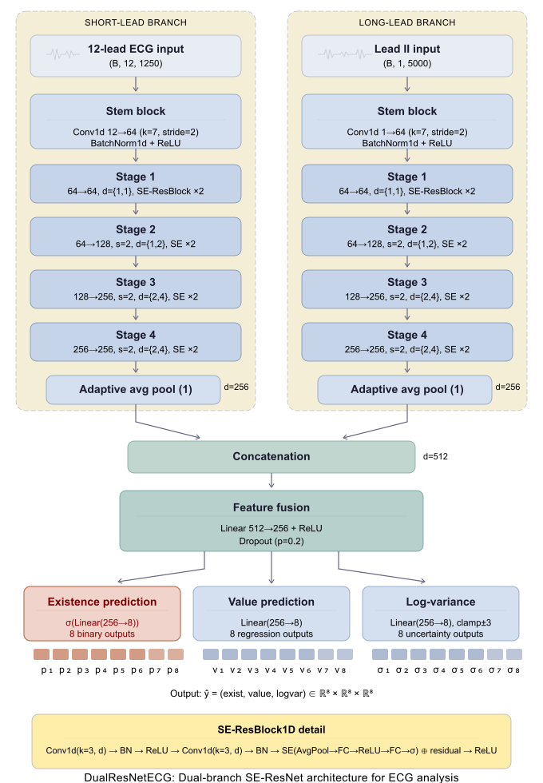

# MUSE ECG PDF: High-Precision Signal Extraction and DualResNetECG for Multi-Parameter Prediction

## Overview

This repository provides a complete end-to-end framework for clinical electrocardiogram (ECG) analysis, including:

1. **High-precision signal reconstruction** from vector-based ECG PDF reports generated by the GE MUSE system.
2. A **C#-based PDF vector parsing tool** for extracting raw ECG time-series signals.
3. A **deep learning framework (DualResNetECG)** for multi-task prediction of clinically relevant ECG parameters.

Unlike conventional approaches relying on rasterized image processing, this framework directly interprets vector path objects within ECG PDFs, enabling accurate reconstruction of original ECG waveforms.

---

## Key Features

### 🔹 Vector-Based ECG Signal Extraction
- Direct parsing of vector graphics from ECG PDF reports (GE MUSE format; 3 × 4 + 1 panel layout)
- Reconstruction of raw ECG time-series signals from PDF path objects
- High-fidelity signal recovery without image-based degradation
- Batch processing support for large-scale ECG archives

### 🔹 DualResNetECG Deep Learning Model
- Dual-input feature learning:
  - 12-lead ECG segments (2.5 seconds)
  - Long lead II rhythm strip (10 seconds)
- Dual-branch residual network architecture incorporating Squeeze-and-Excitation (SE) blocks
- Multi-task learning framework:
  - Regression of ECG parameters
  - Classification of parameter existence (e.g., PR interval, P axis)
- Optimized for clinically relevant ECG interpretation tasks

---

## Repository Structure
- ├── ECGPdfExtractor/           # C# tool for extracting vector-based ECG signals from PDF files
- ├── ECGPdfExtractor_exe/       # Precompiled executable for ECG extraction
- ├── deep_learning_models/      # PyTorch implementation of DualResNetECG and pretrained model weights
- ├── MUSE-ECG-PDF-examples/     # Sample ECG PDF files for validation
- ├── ecg_data_test/             # 1,000 extracted ECG time-series samples for testing
- └── README.md                  # Project documentation


---

## ECGPdfExtractor (C# Signal Extraction Tool)

### Description

`ECGPdfExtractor` is a .NET-based application designed to parse vector-based ECG PDF reports generated by the GE MUSE system. It leverages the `PdfFileAnalyzer` library to extract embedded graphical path objects and reconstruct ECG waveforms.

### Core Capabilities

- Automated batch processing of ECG PDF directories
- Extraction of vector path elements from PDF structure
- Conversion of coordinate paths into digital ECG time-series signals
- Export of reconstructed signals in `.txt` format for downstream analysis

### Usage

1. Build the solution:
```bash
ECGPdfExtractor.sln
```
2. Run the executable and specify the input directory containing ECG PDFs.
3. The tool will automatically:
  Parse PDF vector objects
  Reconstruct ECG signals
  Export time-series data to output directory

---

## Deep Learning: DualResNetECG
### Model Overview

DualResNetECG is a dual-stream residual neural network designed for comprehensive ECG parameter prediction. The architecture integrates complementary feature representations to improve both regression accuracy and classification reliability.

### Architecture Design

<div align="center">
  
</div>


### The model jointly predicts:
- ECG quantitative parameters (regression)
- Existence indicators for key clinical features, including:
- PR interval
- P-wave axis
- QRS-related parameters
- Other clinically relevant ECG intervals and axes

## 📊 DualResNetECG Performance

The **DualResNetECG** model demonstrated robust and accurate performance in predicting clinically relevant ECG parameters. Its effectiveness was evaluated across both **regression tasks** (quantitative parameter estimation) and **classification tasks** (detection of physiological parameter existence).

### 🔹 1. Quantitative ECG Parameter Estimation

DualResNetECG achieved high agreement with the reference standard across eight ECG parameters, consistently yielding low estimation errors and strong coefficients of determination (R²).

#### Ventricular Rate
- **MAE:** 1.11 bpm (95% CI: 1.03–1.21)
- **RMSE:** 3.48 bpm
- **R²:** 0.97

#### Temporal Intervals
| Parameter | MAE (ms) | RMSE (ms) | R² |
|----------|---------|-----------|----|
| **PR Interval** | 7.27 | 14.28 | 0.77 |
| **QRS Duration** | 9.89 | 20.83 | 0.65 |
| **QT Interval** | 11.87 | 23.10 | 0.80 |
| **QTc** | 13.71 | 25.94 | 0.70 |

#### Electrical Axis Estimation
| Parameter | MAE (°) | RMSE (°) | R² |
|----------|---------|-----------|----|
| **P-wave Axis** | 9.33 | 18.28 | 0.49 |
| **QRS (R) Axis** | 8.00 | 22.14 | 0.77 |
| **T-wave Axis** | 16.31 | 34.94 | 0.49 |

These results indicate substantial agreement with reference measurements, particularly for ventricular rate and QRS axis estimation, highlighting the model’s capability for precise clinical parameter prediction.

---

### 🔹 2. Detection of Physiological Parameter Existence

In addition to regression tasks, DualResNetECG effectively identified the **existence** of physiologically defined parameters, specifically the **PR interval** and **P-wave axis**. The model demonstrated excellent discriminative ability with high specificity and negative predictive value, enabling reliable identification of physiologically undefined cases.

#### PR Interval Existence
| Metric | Value |
|-------|------|
| **Accuracy** | 0.96 |
| **Precision** | 0.98 |
| **Recall (Sensitivity)** | 0.98 |
| **Specificity** | 0.81 |
| **F1 Score** | 0.98 |
| **Negative Predictive Value (NPV)** | 0.79 |
| **AUROC** | 0.978 |
| **AUPRC** | 0.995 |

#### P-wave Axis Existence
| Metric | Value |
|-------|------|
| **Accuracy** | 0.95 |
| **Precision** | 0.98 |
| **Recall (Sensitivity)** | 0.97 |
| **Specificity** | 0.82 |
| **F1 Score** | 0.97 |
| **Negative Predictive Value (NPV)** | 0.79 |
| **AUROC** | 0.977 |
| **AUPRC** | 0.995 |

---

### 🔹 3. Summary of Model Strengths

- **High precision** in estimating ventricular rate and ECG temporal intervals.
- **Substantial agreement** with reference standards across electrical axis measurements.
- **Excellent classification performance** for detecting the existence of PR interval and P-wave axis.
- **High specificity and NPV**, enabling reliable identification of physiologically undefined parameters.
- **Strong discriminative ability**, as evidenced by AUROC values approaching 1.0.

### 🔹 4. Clinical Implications

The strong performance of DualResNetECG supports its applicability in:
- Automated ECG interpretation.
- Large-scale digitization and analysis of archival ECG data.
- Clinical decision support systems.
- Research applications requiring accurate and reproducible ECG parameter extraction.

---

*Abbreviations: MAE, Mean Absolute Error; RMSE, Root Mean Square Error; R², coefficient of determination; AUROC, Area Under the Receiver Operating Characteristic Curve; AUPRC, Area Under the Precision–Recall Curve; NPV, Negative Predictive Value.*


### Requirements
1. C# Signal Extraction Tool
.NET Framework 4.0 or higher
PdfFileAnalyzer (integrated)
2. Deep Learning Environment (Python)
```bash
python >= 3.10
```
Dependencies
```bash
torch >= 2.7.0
torchvision
numpy >= 1.19.5
pandas >= 1.3.0
scipy >= 1.7.0
matplotlib
scikit-learn
tqdm
```

## Quick Start
Step 1: ECG Signal Extraction

Place ECG PDF files into a directory and run:

./ECGPdfExtractor_exe/ECGPdfExtractor.exe

The program will automatically process all files and output reconstructed ECG signals.

Step 2: Model Training / Inference
The DualResNetECG model was trained on the full institutional ECG dataset under secure on-premises conditions. Due to privacy-preserving governance restrictions, training data cannot be redistributed.

Navigate to the deep learning module:

cd deep_learning_models
python ecg_main.py

## Acknowledgements

We acknowledge the PdfFileAnalyzer library (https://github.com/Uzi-Granot/PdfFileAnalyzer) for enabling robust parsing of PDF vector structures.
